## Introduction

Seedbucket Remote Agent is a cross-platform utility, fully developed by us, that allows you to synchronize your Seedbucket downloads to your agent automatically. The agent will detect newly downloaded files and fetch them for you in the background.

## Installing the agent

The first step is to install the agent to your system. We support all major platforms (Windows, MacOSX, Ubuntu) but we also provide a Docker image in order to be able to install it to your server. The installation is really easy, just follow these steps:

**1)** Go to your [Seedbucket app](https://seedbucket.seedboxes.cc/).

**2)** On the main sidebar on the left, click **"New"**.

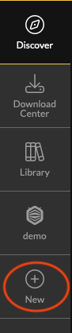

**3)** Click the **Add storage drive** button.

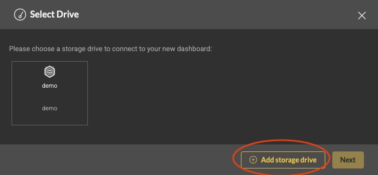

**4)** Select **Remote Agent** and click **Next**.

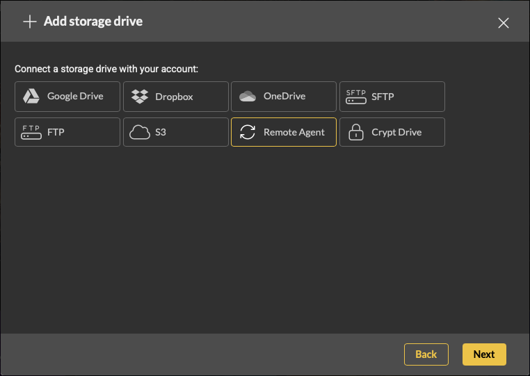

**5)** A modal will appear from which you can select the platform in which you want to install the agent. **Windows** and **MacOSX** will imediatelly start downloading the installer, **Ubuntu** and **Docker** will show you further instructions which you will need to follow in order to complete the installation.

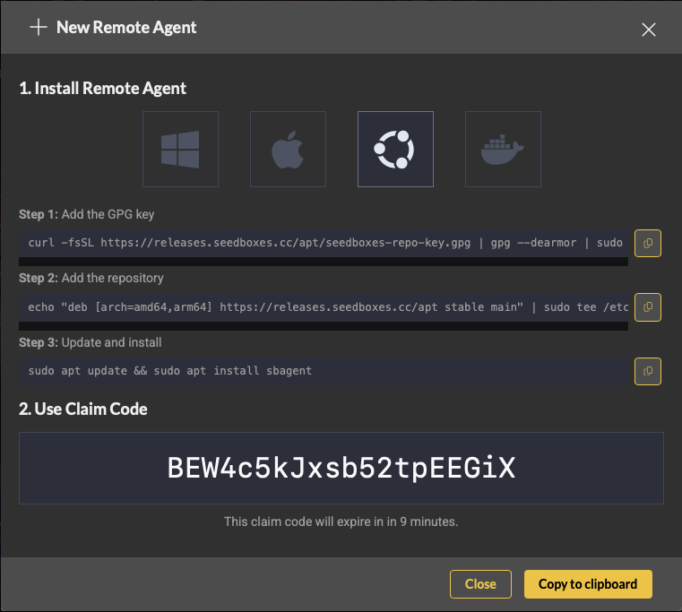

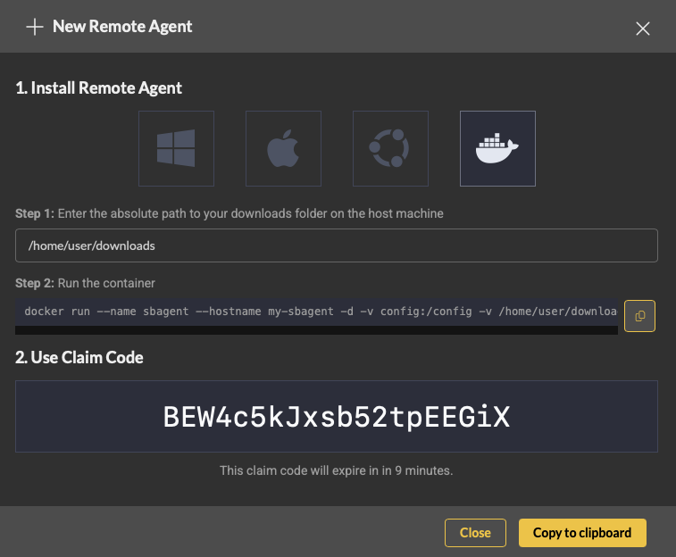

## Registering the agent

**1)** After you complete the installation of the agent, you will need to register it with Seedbucket. This step is NOT required for Docker image, because as you might have noticed, the claim code was already in the command you used to run the image. For the other platforms, you will need to start your agent and a Seedbucket tray icon will appear.

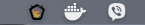

**2)** The first thing you need to setup is your **Downloads** directory. This will be the base directory in which all the downloads will be stored. The agent WILL NOT be able to "see" outside this folder but it will be able to see everything in it. Click on the tray icon and a menu will appear. Click **Downloads Directory**. From here you can set your default downloads directory or quickly visit it by clicking the **Go to downloads directory** menu item.

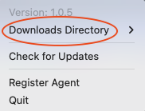

**3)** Next, we need to register the agent with Seedbucket. Click on the tray icon again. Click **Register**. 

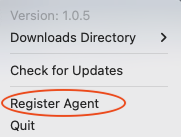

**4)** After you click **Register**, you will automatically be re-directed to your Seedbucket app and the remote agent claim modal will appear and the agent will also prompt you to input your claim code. Click the **Copy to clipboard** button in order to copy the claim code to your clipboard.

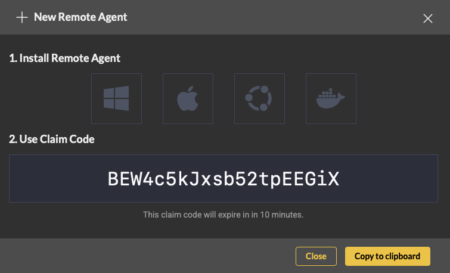

**5)** Paste the claim code in the input prompt of your agent and click **OK**.

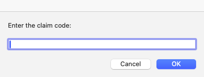

**6)** Wait a few seconds and you should see a success message in your Seedbucket app indicating that the agent was registered successfully. In addition, if you click now the agent's tray icon, it should indicate that it's registered since now you can see some **stats** and a few other menu options, like **Disconnect Agent**.

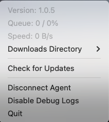

## Using the agent

After installation completes, you should be able to see the remote agent in your [**App Settings > Drives**](https://seedbucket.seedboxes.cc/user/profile#drives) as well. Although you can not create a Dashboard with the remote agent (yet!), it's still just another storage drive in your Seedbucket.

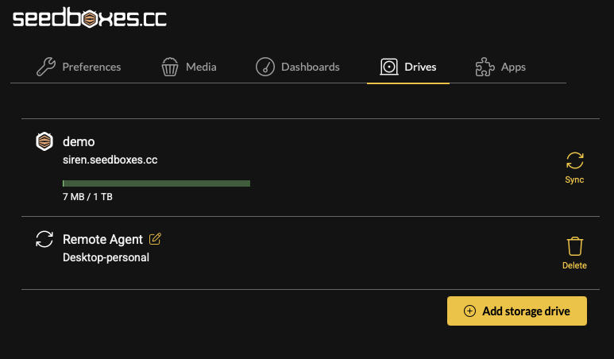

**1)** Go to your [Download Center](https://seedbucket.seedboxes.cc/download-center).

**2)** Click the **+** button from the upper right corner in order to add a new download. The **Download** modal appears.

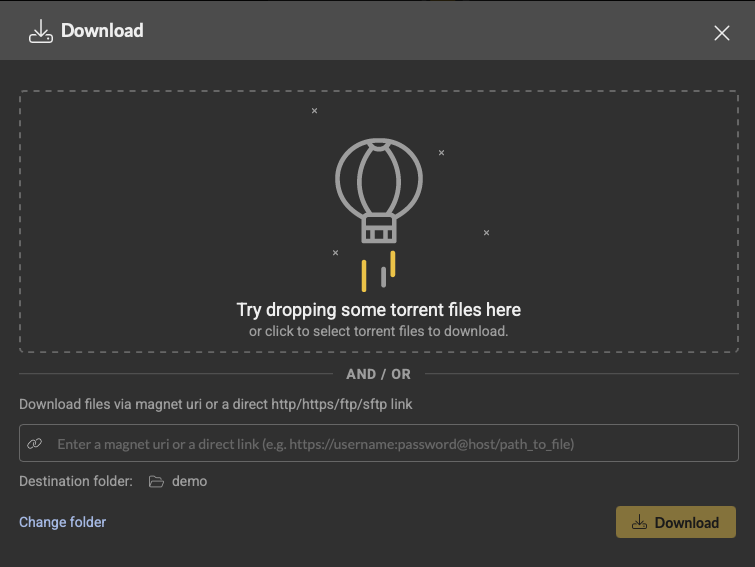

**3)** Click on the **Change folder** button in order to select a folder from your remote agent. The remote agent should be in the dropdown list. Select it and then choose the destination folder. For our example, we will use the **ubuntu** folder which already exists in our demo agent's download folder. Click **Select** and the modal will close.

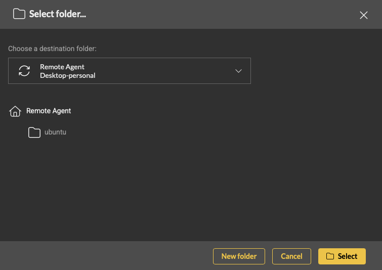

**4)** The remote agent destination folder is now selected. Enter a download http link (or anything else you like) and click the **Download** button.

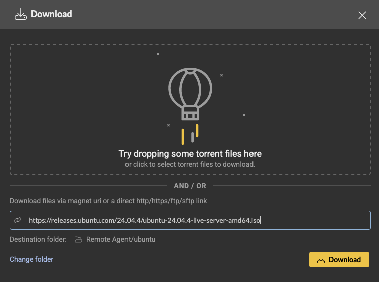

**5)** The download should appear in the download list just like any other download. The main difference is, that as soon as the download has completed downloading in our servers, the download status will change to **Delivering** which means that the files are now being sent to your remote agent. 

If your agent for some reason is offline, the status will change to **Staged** and will be kept for a small period of time in order to give a chance to your agent to come back online and as soon as it does, it will start delivering the files imediatelly. Another thing you will notice if you are running the desktop version of the remote agent, is that if you click on the tray icon, you will now be seeing live stats regarding files fetching.

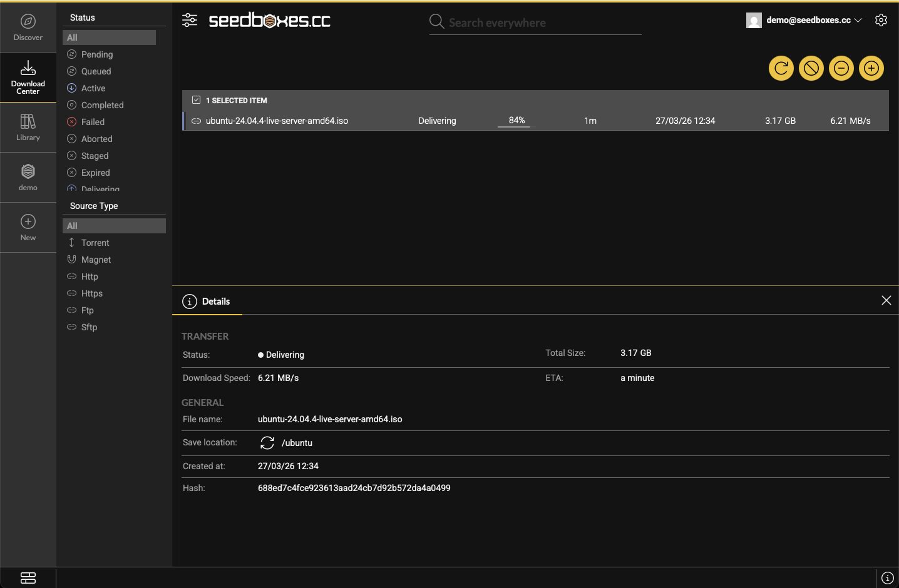

## Auto-updater

As you might have noticed already, remote agent supports auto-updating. It will automatically check once per day if there is an update and prompt you to update if you want. You can also initiate a manual check by clicking the **Check for Updates** menu item from the agent's tray icon.

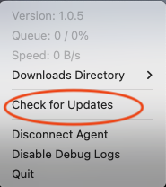

**IMPORTANT NOTE:** The Docker version will automatically update whenever an update is available.

:::info Related Articles
* [How to use Seedbucket?](./How_to_use_Seedbucket.md)
:::